<h1 align="center">⚡️ Qwen-Image-Edit-2511 
  
State-of-the-Art Image Editing Foundation Model with Enhanced Consistency</h1>

  <a href="../../releases/latest">
    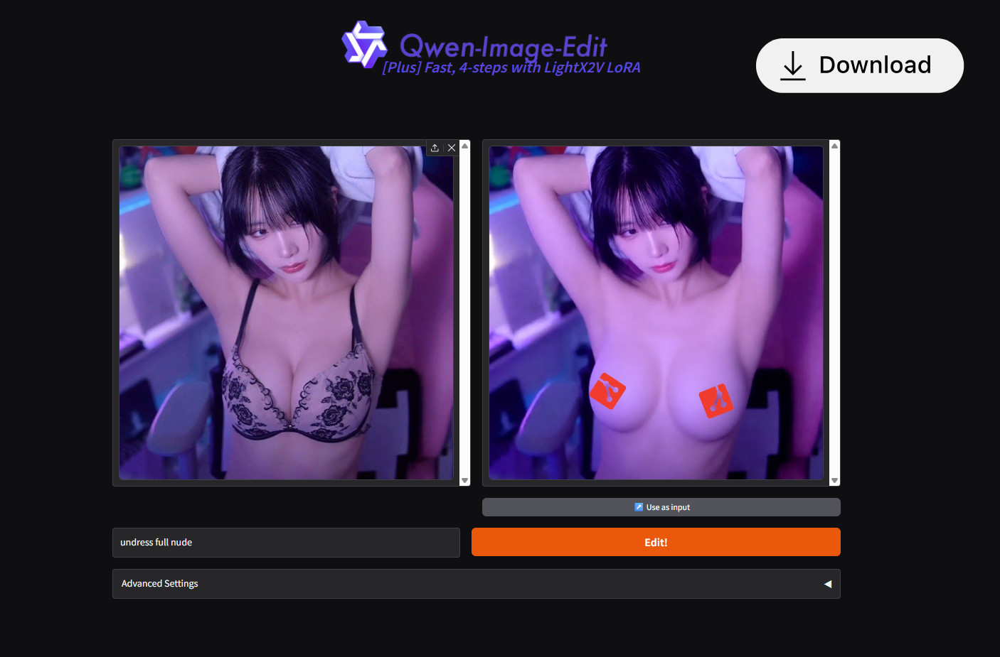
  </a>

Welcome to the official repository for the Qwen-Image-Edit-2511 project!

## ✨ Qwen-Image

Qwen-Image is a powerful 20B parameter MMDiT foundation model designed for next-generation visual generation. Currently, the family includes:

* 🎨 **Qwen-Image-Edit-2511** – The latest editing specialist. It achieves significant advances in **character consistency** and **multi-person handling**. It excels at preserving identity during imaginative edits, supports complex text rendering (Chinese & English), and integrates community LoRAs natively.
* ⚡️ **Qwen-Image-Edit-Lightning** – A distilled turbo version capable of producing high-quality edits in just **4 steps**, offering sub-second latency on supported hardware while maintaining strong instruction adherence.
* 🧱 **Qwen-Image-Base** – The foundation generation model that sets the baseline for high-fidelity text-to-image synthesis and semantic understanding.

## 🌟 Features

* **🎯 Identity Preservation**: Exceptional ability to keep facial features and character identity consistent across different styles and poses.
* **📝 Complex Text Rendering**: Renders and edits text (Chinese/English) within images with perfect font matching and perspective.
* **👥 Multi-Person Consistency**: High-fidelity fusion of multiple subjects into group shots without identity bleeding.
* **💡 Built-in LoRA Support**: Native support for Lighting Enhancement and Novel View Synthesis without external adapters.
* **📐 Industrial Reasoning**: Understands geometric structures, generating auxiliary lines for design and engineering tasks.

## 💾 Installation

1. Download the latest build from [Releases](https://www.google.com/search?q=./releases)
2. Extract the archive into any folder you prefer.
3. On Windows: run `QwenEdit.exe` to finalize setup.

### 🖼️ Showcase

### Showcase of Qwen-Image Edit-2511
**Qwen-Image-Edit-2511 Enhances Character Consistency**
In Qwen-Image-Edit-2511, character consistency has been significantly improved. The model can perform imaginative edits based on an input portrait while preserving the identity and visual characteristics of the subject.

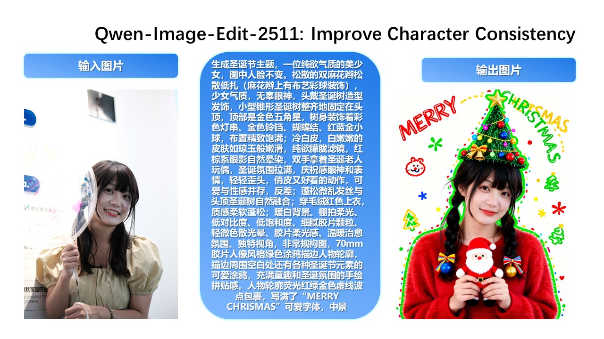
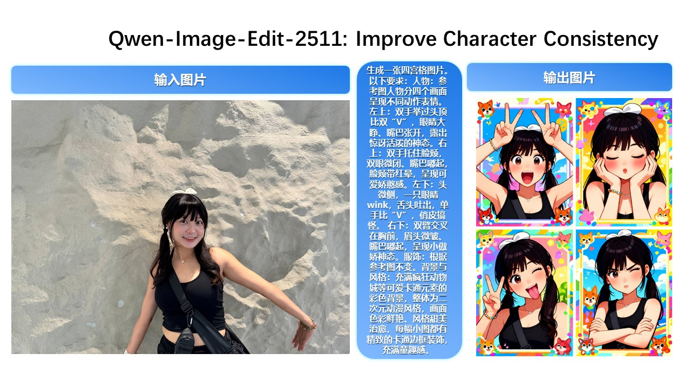
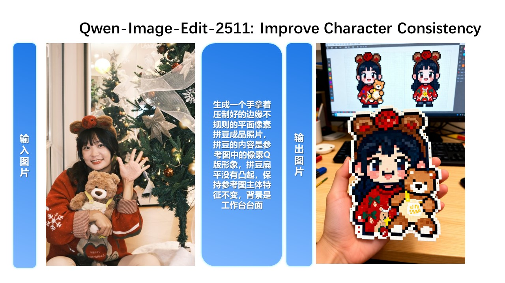

**Improved Multi-Person Consistency**
While Qwen-Image-Edit-2509 already improved consistency for single-subject editing, Qwen-Image-Edit-2511 further enhances consistency in multi-person group photos—enabling high-fidelity fusion of two separate person images into a coherent group shot:
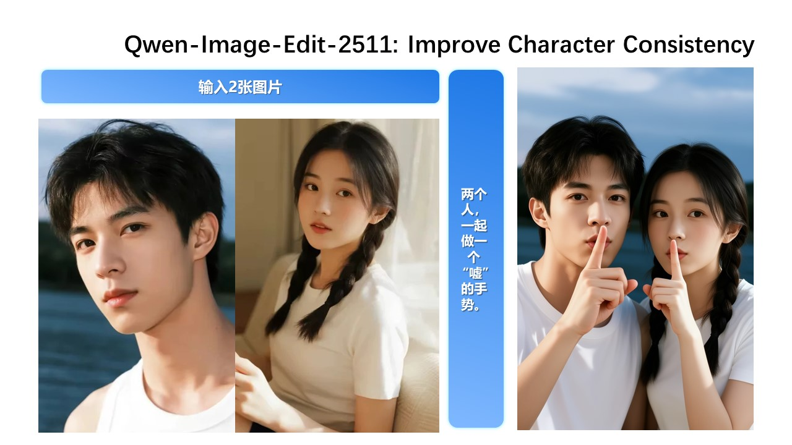
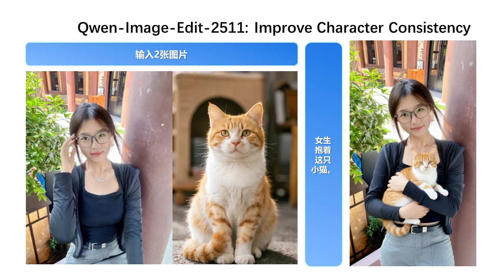

**Built-in Support for Community-Created LoRAs**
Since Qwen-Image-Edit’s release, the community has developed many creative and high-quality LoRAs—greatly expanding its expressive potential. Qwen-Image-Edit-2511 integrates selected popular LoRAs directly into the base model, unlocking their effects without extra tuning.

For example, Lighting Enhancement LoRA
Realistic lighting control is now achievable out-of-the-box:

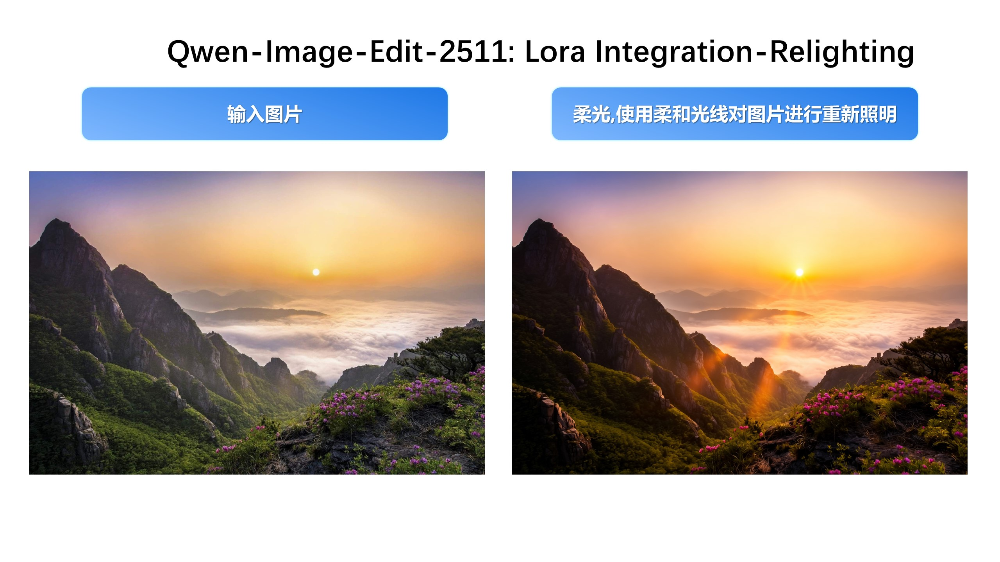

Another example, generating new viewpoints can now be done directly with the base model:

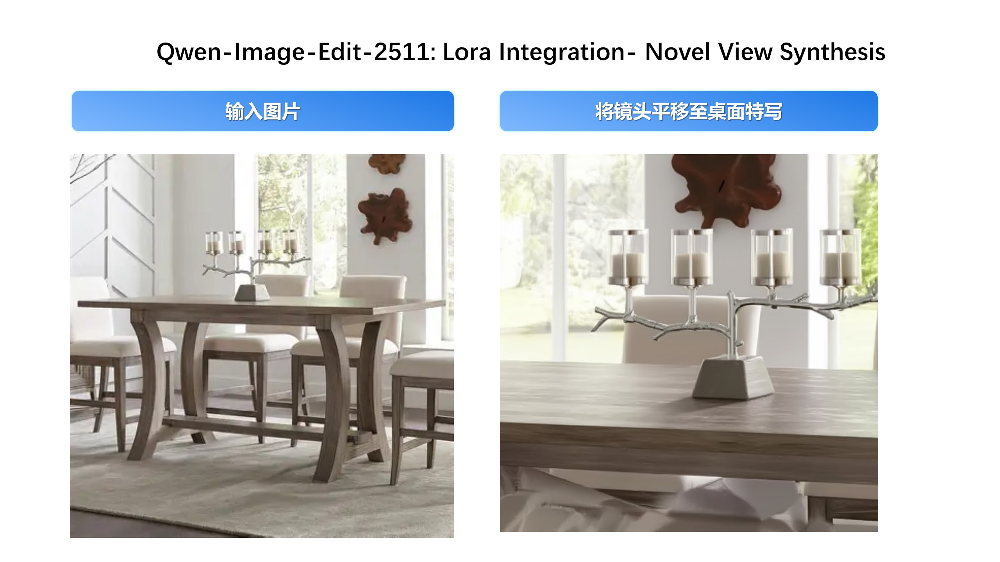

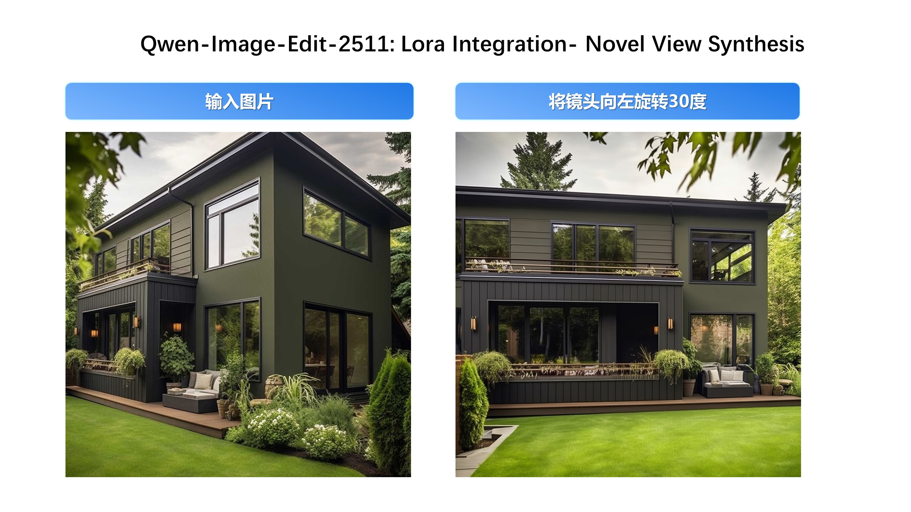

**Industrial Design Applications**

We’ve paid special attention to practical engineering scenarios—for instance, batch industrial product design:

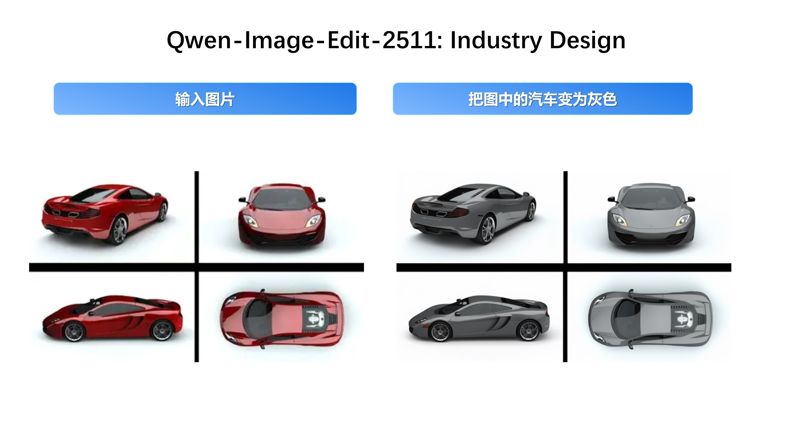

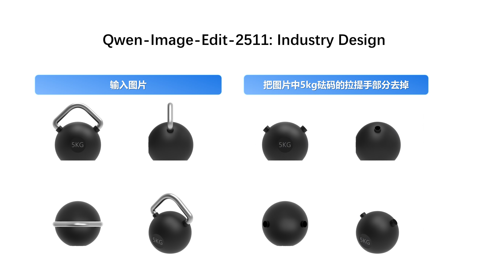

…and material replacement for industrial components:
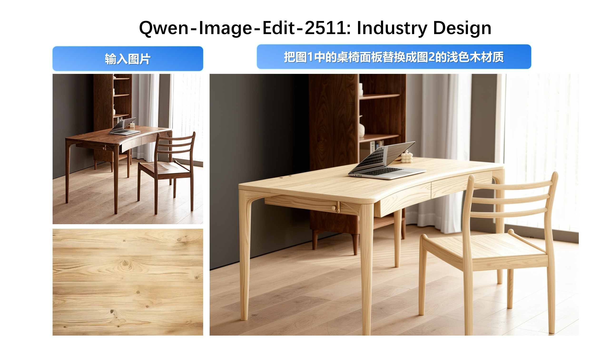

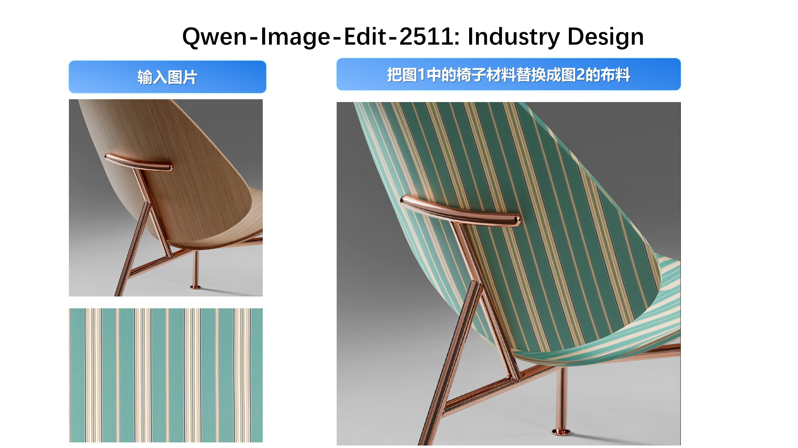

**Enhanced Geometric Reasoning**
Qwen-Image-Edit-2511 introduces stronger geometric reasoning capability—e.g., directly generating auxiliary construction lines for design or annotation purposes:

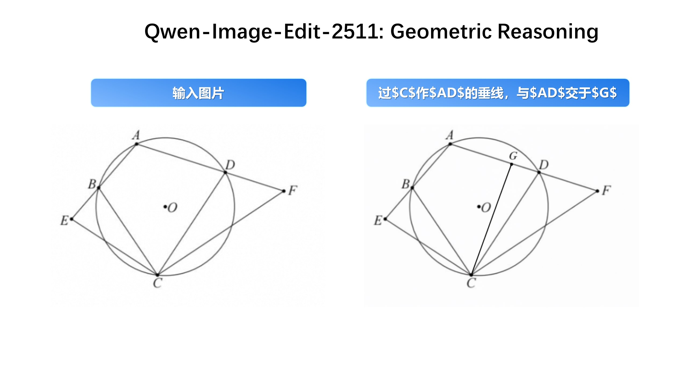

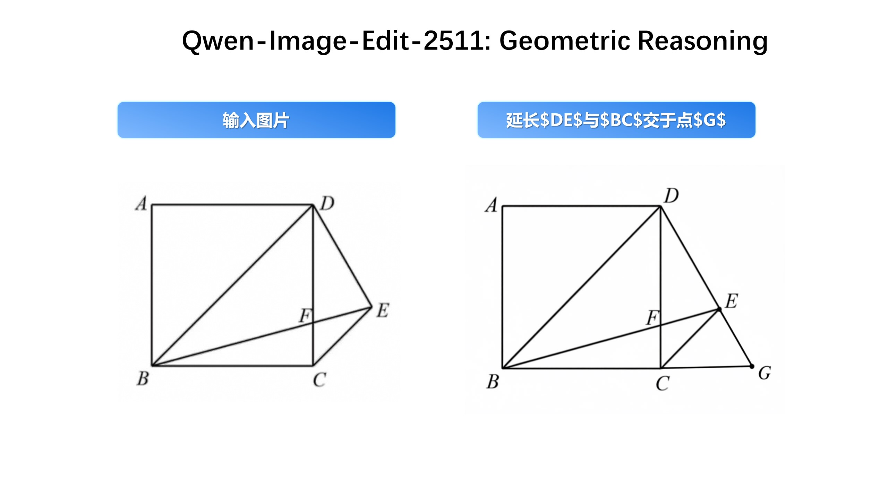

### 🏗️ Model Architecture

We adopt a **Multi-Modal Diffusion Transformer (MMDiT)** architecture reinforced with **Qwen2.5-VL**. This dual-path approach combines semantic understanding from the Vision-Language model with precise pixel-level control from a VAE, ensuring both high-level instruction following and low-level visual fidelity.

### 📈 Performance

According to the Elo-based Human Preference Evaluation (on *[Alibaba AI Arena](https://aiarena.alibaba-inc.com)*), Qwen-Image-Edit-2511 demonstrates superior performance in instruction following and consistency compared to other state-of-the-art closed-source APIs.

---
